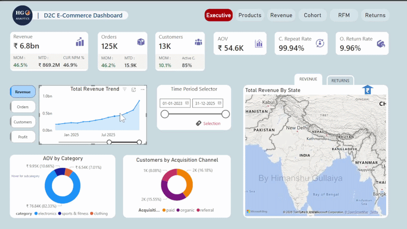
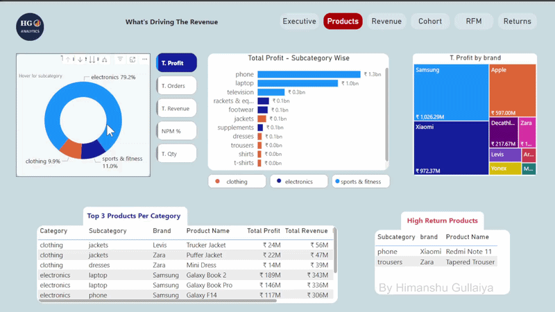
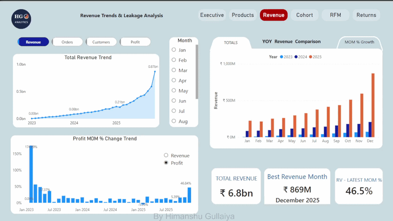
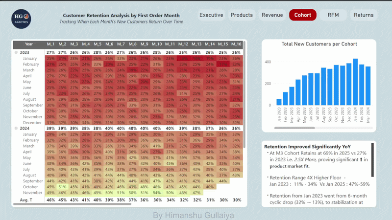
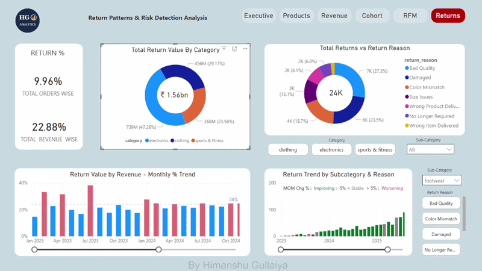

# HG Analytics — D2C E-Commerce Analytics Dashboard

End-to-end analytics pipeline for an Indian D2C e-commerce business — built entirely from scratch, no public datasets used.

**▶ https://www.youtube.com/@prowealthacademy1/videos &nbsp;|&nbsp; 📊 [Live Dashboard](#)**

---

## Dashboard Preview

**Executive**



---

**Products**



---

**Revenue**



---

**RFM + Cohort**



---

**Returns**



---

## What This Project Does

Programmatically generates asymmetric realistic Indian D2C transactional data (200K+ rows), goes through medallion architecture where it injects production-grade data quality issues, cleans it with a documented Python pipeline, loads and create gold materialized views in PostgreSQL, and visualizes everything in a 6-tab Power BI dashboard answering real business questions.

---

## Tech Stack

`Python` &nbsp;·&nbsp; `PostgreSQL` &nbsp;·&nbsp; `Power BI` &nbsp;·&nbsp; `Pandas / NumPy` &nbsp;·&nbsp; `Faker`

---

## Pipeline — Medallion Architecture

```
Python (generate + dirty + clean)  →  PostgreSQL (silver + gold)  →  Power BI
        Bronze (raw)  →  Silver (clean)  →  Gold (aggregated views)
```

**Bronze** — raw dirty data preserved as-is  
**Silver** — cleaned and validated data  
**Gold** — 6 materialized views powering the dashboard  

---

## Data Generation

- ~125K orders, 13K customers, 84 products across 3 categories
- Indian D2C patterns — Faker for names, weighted city-state CSV, Poisson-distributed order frequency
- Category-weighted return reasons (electronics → Damaged, clothing → Size Issues / Color Mismatch)
- Two unit prices — `products.unit_price` (catalog) and `order_items.unit_price_at_purchase` (SCD Type 2)

---

## Data Quality — 9 Issues Injected & Fixed

| Issue | Fix |
|-------|-----|
| Null values (email, phone, qty) | fillna / smart imputation from related columns |
| Duplicate rows | drop_duplicates on primary keys |
| Mixed date formats | pd.to_datetime(dayfirst=True) |
| Outliers (unit_price, order_amount) | IQR subcategory-wise — not global |
| Orphan records | Cascade delete orders → order_items |
| Inconsistent categories (city case, payment_method) | str.title() |
| Invalid values (negative age, zero qty) | Replace with mean / derived value |
| Wrong data types | astype() + to_datetime() |
| Inconsistent string formats | str.strip().str.title() |

> Duplicates removed last — earlier cleaning steps create apparent duplicates that only become visible after imputation.

---

## PostgreSQL — Gold Layer Views

| View | What it answers |
|------|----------------|
| v_cohort_retention | Which signup months retain customers best? |
| v_rfm_segmentation | Who are Champions, At Risk, Lost customers? |
| v_product_performance | Which products drive profit vs hurt it? |
| v_revenue_monthly | How is revenue trending MOM? |
| v_returns_analysis | Which subcategory+reason combinations are worsening? |
| v_executive_kpis | What does the business look like this month? |

**Key problem solved — Fan-out:** Joining orders → order_items (one-to-many) then summing `order_amount` caused 2x revenue inflation. Fixed by always aggregating from `order_items.total_sales_curr_order`.

---

## Power BI — 6 Tab Dashboard

### Key Numbers
| Metric | Value |
|--------|-------|
| Total Revenue | ₹6.8bn |
| Orders | 125K |
| Customers | 13K |
| AOV | ₹54.6K |
| Profit Margin | ~46.8% |
| Return Rate (orders) | 9.96% |
| Return Rate (revenue) | 22.88% |

### Tabs

**Executive** — 6 KPI cards with MOM/MTD, revenue trend, map toggle (Revenue by State ↔ Return % by State), AOV by Category, Acquisition Channel breakdown

**Products** — Field parameter switcher (Profit / Orders / Revenue / NPM% / Qty), subcategory bar, brand treemap, Top 3 products per category, High Return Products flag

**Revenue** — YOY comparison (2023/2024/2025), MOM% trend, best month, bookmark toggle between TOTALS / YOY / MOM views

**Cohort** — Retention heatmap M1–M16, cohort size bar, pre-written business insights. 2025 cohorts retaining at 69% vs 27% in 2023 — 2.5x improvement

**RFM** — Segment distribution (60% Growth / 40% Concern), avg revenue per segment, top 10 customers, action recommendations per segment, state-wise distribution

**Returns** — Return value by category, return reasons breakdown, monthly % of revenue trend (conditional green/red), return trend by subcategory+reason colored by `return_condition_flag` (Worsening / Improving / Stable)

### Notable Features
- MOM% and MTD on every KPI card
- Field parameters for metric switching across charts
- Bookmark toggle — map Revenue vs Returns, Revenue tab view switching
- `return_condition_flag` conditional bar coloring — red/green/grey per month
- Isolated slicers — top visuals always show full distribution
- Dynamic titles using selected field parameter

---

## Known Limitations

- Revenue calculated pre-discount (~4.5% not deducted)
- Repeat Rate 99.94% is a Poisson lam=10 artifact — real D2C is 40–60%
- Returns modeled at order level, not product level

---

## Project Structure

```
D2C-ecommerce_analytics/
├── Scripts/
│   ├── generate_data.py
│   ├── inject_dirty_data.py
│   ├── clean_data.py
│   └── testing_data_after_cleaning.py
├── SQL/
│   └── gold_*.sql  (6 views)
├── Dashboard/
│   └── HG_Analytics_D2C.pbix
├── Powerbi_Report/
│   └── GIFS/
└── README.md
```

---

*[Himanshu Gullaiya](https://github.com/himanshugullaiya) — Data Analyst | Python · SQL · Power BI*
